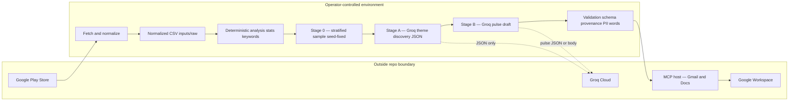
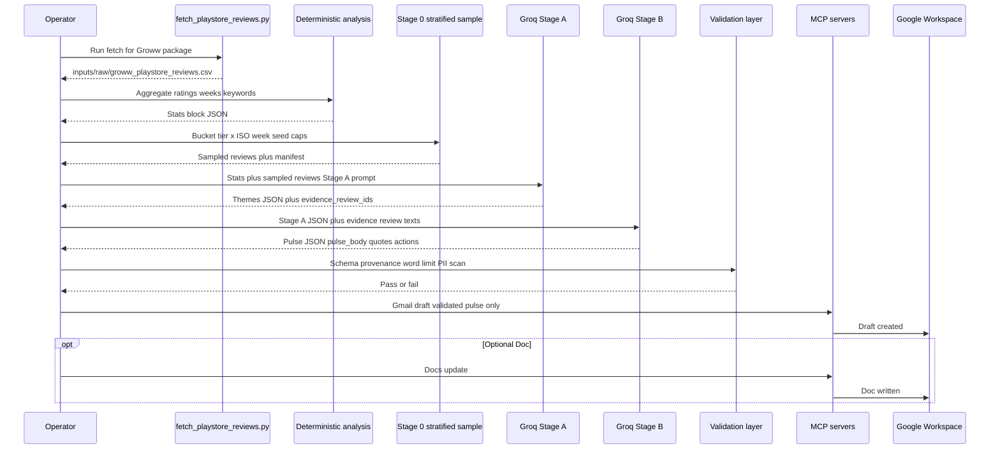

# Architecture: Weekly Review Pulse Agent — Groww (MCP + Groq)

This document describes how the weekly Groww Play Store review pulse is produced and delivered using **Groq** as the LLM inference backend, an AI agent for orchestration, and **Model Context Protocol (MCP)** for Gmail and Google Docs delivery—without embedding Google REST clients or OAuth flows in application code.

---

## 1. Purpose and scope

### 1.1 What this system does

- Ingests **public** Groww Play Store reviews (`com.nextbillion.groww`) via `google-play-scraper`.
- Restricts analysis to a **rolling 8–12 week window** of normalized, English-only, substantive reviews (>6 words, no emojis).
- Runs **deterministic stratified sampling** (rating tier × ISO week, seed-fixed, negative-heavy) to reduce token noise before LLM calls.
- Uses a **two-stage Groq pipeline**: Stage A (theme discovery, JSON + evidence `review_id`s) → Stage B (concise pulse with quotes and actions, ≤250 words).
- Applies a **deterministic validation layer** (schema, quote provenance, word limit, PII scan) before delivery.
- **Delivers** via **Gmail MCP** (draft) and optionally **Google Docs MCP**.

### 1.2 What this system explicitly does not do

- Scrape storefronts behind authentication or bypass store terms of use.
- Use App Store / iTunes data (Groww is Play Store only for this milestone).
- Call Google APIs directly from application code for Gmail or Docs.
- Auto-send email; **draft-first** is the default unless changed in [decision.md](./decision.md).

---

## 2. Stakeholders and context

| Stakeholder | Interest |
|-------------|----------|
| Product and growth | Prioritization signals from real user language |
| Support | Early awareness of recurring complaints and praise |
| Leadership | Low-effort weekly health narrative |
| Operator (you or the agent runner) | Repeatable run with clear inputs, outputs, and failure handling |

**System context:** The operator runs the fetch script to populate `inputs/raw/`. The agent and Groq handle analysis and composition. Gmail/Docs sit outside the repo boundary, reached only through MCP.

---

## 3. Architectural principles

1. **Separation of concerns:** Ingestion/normalization, LLM-powered analysis, composition, and MCP delivery are distinct layers.
2. **MCP as the Google boundary:** Gmail drafts and Docs operations go through MCP only.
3. **Groq as the inference boundary:** Theme discovery and pulse drafting are **separate** Groq calls (Stage A then Stage B). No model weights are stored locally.
4. **Production-style separation:** Deterministic statistics and **Stage 0 stratified sampling** precede LLM calls; narrative drafting consumes only Stage A output plus provenance-grounded review text.
5. **Privacy by default:** Author names are excluded at fetch time. Quotes in the pulse may be paraphrased to prevent identity leakage.
6. **Human-in-the-loop:** Drafts allow review before any future send step.
7. **Traceability:** Decisions in [decision.md](./decision.md); phase exit quality in `eval.md` files.

---

## 4. High-level system view



---

## 5. Logical decomposition

### 5.1 Ingestion layer (Phase 1 — complete)

**Input:** Public Play Store page for `com.nextbillion.groww`.

**Processing:** `scripts/fetch_playstore_reviews.py` fetches up to 15,000 raw reviews, then applies normalization:
- 12-week date window
- Deduplication by `review_id`
- English only (non-Latin scripts removed)
- Minimum 7 words
- Emoji-free

**Output:** `inputs/raw/groww_playstore_reviews.csv` — canonical schema: `rating,title,text,date,source_store,review_id`.

Current corpus: **~2,100 reviews** (normalized CSV); **≤1,000 reviews** may enter Groq-bound stages after Stage 0 (see §5.3, §6.1).

### 5.2 Deterministic analysis (before sampling)

**Input:** Normalized review CSV (`inputs/raw/groww_playstore_reviews.csv`).

**Processing (no LLM):**

- Rating distribution (counts and percentages per star).
- Volume and average rating per **ISO week** (from `date`).
- Keyword / bigram aggregates (same signals documented in [phase-02 data-analysis](./phases/phase-02/data-analysis.md)).

**Output:** A compact statistics block (JSON or markdown fragment) embedded in Stage A/B prompts and logged with the run id.

### 5.3 Stage 0 — stratified sampling (deterministic, reproducible)

**Goal:** Produce a **representative** subset capped at **≤1,000 reviews** for Groq-bound stages, faithful to pain signals (negative reviews carry more diagnostic language in this corpus), while staying inside **tokens-per-minute** and **tokens-per-day** quotas (§6.1).

**Buckets:** Cartesian product of **rating tier** × **ISO week** (year-week from `date`).

**Rating tiers (recommended):**

| Tier | Stars | Role in sampling |
|------|-------|------------------|
| Negative | 1–2 | **Highest priority** — larger per-cell caps |
| Neutral | 3 | Moderate caps |
| Positive | 4–5 | Lower caps — preserves praise without drowning themes |

**Procedure (conceptual):**

1. Group rows by `(iso_week, tier)`.
2. Within each group, **sort deterministically** (e.g. by `review_id` ascending) so ordering is stable across runs.
3. Apply **per-group caps** — negatives highest, positives lowest (exact integers are configuration). **Hard ceiling:** once **1,000** reviews are selected across all buckets, stop (remaining buckets may be under-filled).
4. Draw a **deterministic subsample** per group: e.g. take every *k*-th row after sorting, or reservoir sampling driven only by a **fixed integer seed** recorded in run metadata (`SAMPLER_SEED`). No randomness without logging seed.

**Stage A payload shaping (deterministic, reduces tokens without changing ids):** For theme discovery only, optionally **truncate** each sampled review’s `text` to a **fixed maximum character length** (configurable, e.g. 280–400 chars) using a stable rule (suffix ellipsis). Full text remains available in the normalized CSV for Stage B **evidence** expansion and validators.

**Artifacts:** Write `data/working/sample_manifest.json` (or equivalent) listing `review_id`, tier, week, seed, caps — enables audit and quote provenance checks.

**Output:** `sampled_reviews[]` — at most **1,000** rows passed toward Stage A (plus the global stats block from §5.2).

### 5.4 Stage A — Groq theme discovery

**Input:**

- Deterministic statistics (§5.2).
- Sampled review texts keyed by `review_id` (Stage 0).

**Groq call(s):**

- **JSON-only** structured output (enforce in prompt; parse with strict schema validation afterward).
- Ask for **up to 5 themes**, ranked, each tied to **evidence** as an explicit list of **`review_id` values** drawn **only** from the sampled set.

**Chunking to respect TPM (§6.1):** If the estimated **input** tokens for one Stage A prompt (stats + truncated sampled reviews + instructions) exceed the **per-request token budget** (~9k input tokens, conservative vs **12k TPM**), split sampled reviews into **ordered chunks**. Execute **one Groq Stage A request per chunk**, with **≥60 seconds** between successive Groq requests (same run). **Prefer deterministic consolidation** of chunk-level theme JSON in application code (merge labels, union `evidence_review_ids`, re-rank by counts from §5.2) to **avoid** an extra Groq “merge” call and save **tokens/day**. Use a **small Groq merge** only if deterministic merge is insufficient.

**Example schema shape (illustrative):**

```json
{
  "themes": [
    {
      "rank": 1,
      "label": "short neutral label",
      "summary": "1–2 sentences grounded in evidence ids",
      "evidence_review_ids": ["id1", "id2", "id3"]
    }
  ],
  "notes": "optional model self-check, not shown to stakeholders"
}
```

**Output:** Validated Stage A JSON. If schema validation fails → retry once with repair prompt; else abort run.

### 5.5 Stage B — Groq pulse drafting

**Input:**

- Stage A JSON (themes + evidence ids).
- **Full text** for reviews referenced in `evidence_review_ids` **union** any ids the pipeline adds for quote diversity (still must be subsets of sampled or full corpus with logged provenance).
- Deterministic statistics (§5.2) for a one-line executive context if desired.

**Groq call:**

- Produce the **weekly pulse**: **top 3 themes** for prose, **exactly 3** user quotes (paraphrased allowed), **exactly 3** actions.
- **`pulse_body` ≤ 250 words** (validator enforces after generation).
- Structured JSON preferred (`pulse_body`, `quotes[]`, `actions[]`) so validation can run before rendering plain text for email.

### 5.6 Deterministic validation layer (mandatory before MCP)

Run **after** Stage B, **before** Gmail/Docs:

| Check | Rule |
|-------|------|
| **JSON schema** | Stage A and Stage B payloads conform to agreed JSON Schema / pydantic models |
| **ID existence** | Every `review_id` cited in themes or quotes exists in normalized input CSV |
| **Quote provenance** | Each quote maps to at least one cited `review_id`; optional fuzzy / embedding check that paraphrase still aligns with source text (minimum: substring overlap or manual spot-check until automation lands) |
| **Word limit** | `pulse_body` ≤ 250 words (tokenization-aware counting optional; word split acceptable per problem statement) |
| **PII scan** | Reject or strip email-like patterns, `@handles`, phone patterns, and Google Play–specific identifiers if present in outbound text |

Failed validation → do not call MCP; operator reviews logs and may re-run Stage B with tightened instructions.

### 5.7 Fallback strategy — chunk-and-merge (when sampling is insufficient)

Use when:

- Sample + prompts still exceed safe **per-request** size after truncation and chunking, **or**
- Stage A JSON repeatedly fails validation after **at most one** retry per chunk (protect **requests/day** and **tokens/day**).

**Pattern:**

1. Partition sampled reviews into chunks each under the **Stage A per-request token budget** (§6.1).
2. **Stage A per chunk** → intermediate theme JSON list; **≥60 seconds** between Groq requests.
3. **Merge pass:** Prefer **deterministic** consolidation (dedupe labels, union `evidence_review_ids`, re-rank using §5.2 signals). Optional **small** Groq merge only if needed.
4. **Stage B** unchanged; **≥60 seconds** after last Stage A request before Stage B when required by TPM pacing rules.

Chunk-and-merge is **fallback**, not the default path; with **≤1,000** truncated reviews and conservative chunk sizes, a weekly run should remain within **100k tokens/day** and **1k requests/day** (§6.1).

### 5.8 Composition / handoff to MCP

**Input:** Validated Stage B output.

**Processing:**

- Render final email-friendly plain text (or MCP-required format) from validated JSON.
- Optional local copy under `artifacts/` for debugging.

**Output:** Final text ready for MCP delivery (§5.9).

### 5.9 Delivery layer (Phase 4 — MCP-mediated)

**Input:** Final pulse text (after validation), recipient policy, optional Doc target.

**Processing:**
- **Gmail MCP:** Create draft with week-labeled subject line and pulse body.
- **Google Docs MCP (optional):** Create or append pulse to a running document.
- Capture delivery outcomes (success/failure) in operator logs.

**Output:** Draft in Gmail; optionally updated Doc.

---

## 6. LLM integration details (Groq)

| Aspect | Choice |
|--------|--------|
| Provider | [Groq](https://groq.com/) — cloud-hosted LLM inference |
| Primary model | `llama-3.3-70b-versatile` |
| Fallback model | Document alternate Groq deployment only after re-validating its quotas |
| API access | Groq REST API via API key (environment variable, never committed) |

### 6.1 Published quotas for `llama-3.3-70b-versatile` (planning assumptions)

These limits drive **Stage 0 cap**, **Stage A chunking**, **pacing**, and **retry policy**:

| Limit | Value | Pipeline implication |
|-------|--------|---------------------|
| Requests per minute | **30** | Weekly pipeline uses **few** sequential calls; no burst parallelism needed |
| Requests per day | **1,000** | Prefer **deterministic merge** after chunked Stage A to avoid extra Groq merge calls; cap **retries** (e.g. one JSON repair per chunk max) |
| Tokens per minute | **12,000** | Treat as requiring **small per-request payloads** and **time pacing** between calls |
| Tokens per day | **100,000** | Budget **all** Stage A chunks + Stage B + retries; estimate tokens **before** the run |

**Operational rules (defaults):**

1. **Review volume entering Groq:** Stage 0 **hard cap ≤ 1,000** sampled reviews (full normalized CSV may hold ~2,100+ rows — sampling always trims before LLM).
2. **Per-request token budget:** Target **≤ ~9,000 input tokens** per Groq request (instructions + stats + truncated review payload), leaving headroom for completion within the same rolling minute as **12k TPM**.
3. **Truncation for Stage A only:** Deterministic max-length clip per review text (see §5.3); Stage B expands **full** text only for evidence ids (typically far fewer than 1,000 rows).
4. **Pacing:** **≥ 60 seconds** between successive Groq HTTP requests in one pipeline run unless monitoring proves higher safe throughput.
5. **Chunked Stage A:** If estimated input exceeds the per-request budget, split sampled reviews into chunks; run Stage A **once per chunk** with pacing; **merge deterministically in code** when possible (no extra Groq call).
6. **Stage B:** Usually one request; keep evidence-expanded texts bounded (Stage A should cite modest-sized `evidence_review_ids` lists — enforce max ids per theme in schema if needed).
7. **Retries:** At most **one** repair attempt per failed chunk / Stage B to protect **1k RPD** and **100k TPD**; log token counts either way.
8. **Pre-flight estimator:** Before calling Groq, compute rough `tokens ≈ 1.3 × word_count` for payload + reserve **~1–2k** for model output in **daily** planning.

**Typical weekly run (order of magnitude):** With ≤1k truncated reviews split across **N** Stage A chunks (~9k input tokens each) plus **one** Stage B (~≤15k tokens combined), plan **N × 9k + 15k + retry headroom < 100k** — if **N** would exceed budget, **lower** Stage 0 cap, **increase** truncation aggressiveness, or **reduce** chunk count by tightening per-review clip.

### Prompt design principles

**Stage A (theme discovery)**

1. **JSON-only output** — no markdown fences; validate against JSON Schema after completion.
2. **Evidence requirement** — every theme must list `evidence_review_ids` from the sampled id universe only.
3. **Grounding** — inject deterministic stats (§5.2) so rankings align with corpus-level signals.

**Stage B (pulse drafting)**

1. **Structured output** — JSON with `pulse_body`, `quotes[]` (each with `review_id`s), `actions[]`; render plain text after validation.
2. **Constraint enforcement** — top **3** themes in prose, exactly **3** quotes, exactly **3** actions; **≤250 words** on `pulse_body` (enforce deterministically post-hoc).
3. **PII guardrails** — paraphrase quotes; never invent ids; never emit author fields.

**Shared**

- **Tone:** Professional, neutral, factual — not blaming users, not marketing spin.

---

## 7. Data flow for a single weekly run



---

## 8. Trust and configuration boundaries

| Zone | Holds | Implication |
|------|--------|-------------|
| Repo | Problem statement, architecture, plans, eval criteria, scripts | No secrets; no live PII in committed samples |
| Operator machine / Cursor | MCP config, Groq API key (env var), OAuth tokens for MCP | Rotate per org policy; never commit |
| Groq cloud | LLM inference; **Stage A** receives sampled review text + stats; **Stage B** receives Stage A JSON + evidence-expanded texts | Review text has no author names at fetch; retention per Groq policy |
| Google Workspace | Mail and Doc storage | Retention per workspace admin rules |
| Play Store | Public review pages | Treat review text as potentially sensitive; minimize copies |

---

## 9. Quality attributes

- **Correctness:** Themes reflect the actual review corpus; no hallucinated statistics.
- **Safety:** No PII in outbound text. Quotes paraphrased where needed.
- **Speed:** Stage 0 and validation are local; Groq calls are **paced** (§6.1) — a weekly run may take **minutes** if Stage A is chunked; stay within TPM/TPD.
- **Operability:** A new operator can complete a run using the Phase 5 runbook.
- **Maintainability:** Stage A, Stage B, Stage 0 caps, and validator schemas can evolve independently; swapping Groq models is localized to the inference client.

---

## 10. Failure modes and mitigations

| Failure | Symptom | Mitigation |
|---------|---------|------------|
| Groq API key missing | Auth error on LLM call | Check env var at script start; fail fast with clear message |
| Groq rate limit hit | HTTP 429 or quota errors | **Exponential backoff**; enforce **≥60s** pacing; reduce Stage A chunk size or truncation length; finish run next calendar day only if **TPD** exhausted |
| TPM / TPD exceeded mid-run | Errors late in chunked Stage A | Stop; lower **1,000** cap or shorten truncation; fewer chunks; deterministic merge without extra Groq calls |
| Corpus too large / Stage A overflows per-request budget | Token limit or truncation errors | Reduce per-cell caps in Stage 0; shorten truncation; or fall back to **chunk-and-merge** (§5.7) |
| Stage A invalid JSON | Parse errors | Retry once with repair prompt; log raw response securely |
| Evidence ids hallucinated | Validator fails ID existence | Re-prompt Stage A with explicit “ids MUST be from supplied list” |
| MCP auth expired | Tool errors on deliver | Operator renewal procedure in runbook |
| PII leakage | Quotes contain handles or names | Author names stripped at fetch; PII regex check before delivery |
| Sparse week | Very few reviews for a given week | Widen window or state "insufficient data" in pulse |

---

## 11. Observability

**Log:**
- Run identifier, week label, counts (normalized → **Stage 0 sampled** → evidence ids used in Stage B)
- Groq model, **Stage A chunk index / count**, Stage B flag, **estimated vs actual** tokens per request, cumulative **daily** token tally
- Validation pass/fail reasons (schema field, missing id, word count, PII rule hit)
- MCP call success/failure

**Do not log:**
- Full review text in shared logs
- API keys or MCP tokens

---

## 12. Related documents

- [Problem statement](./problemstatement.md)
- [Implementation plan](./implementationplan.md)
- [Decision log](./decision.md)
- Phase evaluations: [Phase 1](./phases/phase-01/eval.md) · [Phase 2](./phases/phase-02/eval.md) · [Phase 3](./phases/phase-03/eval.md) · [Phase 4](./phases/phase-04/eval.md) · [Phase 5](./phases/phase-05/eval.md)
